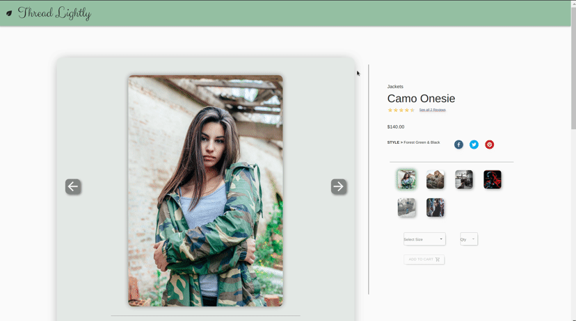
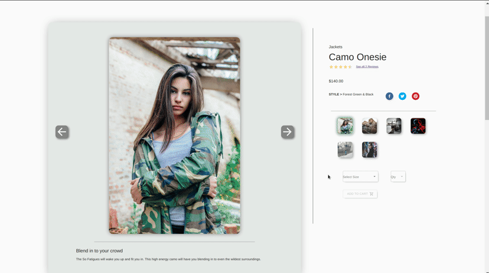
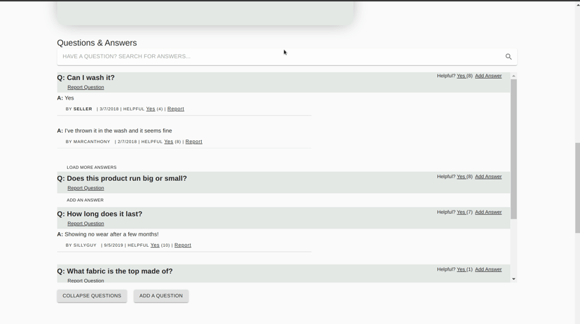
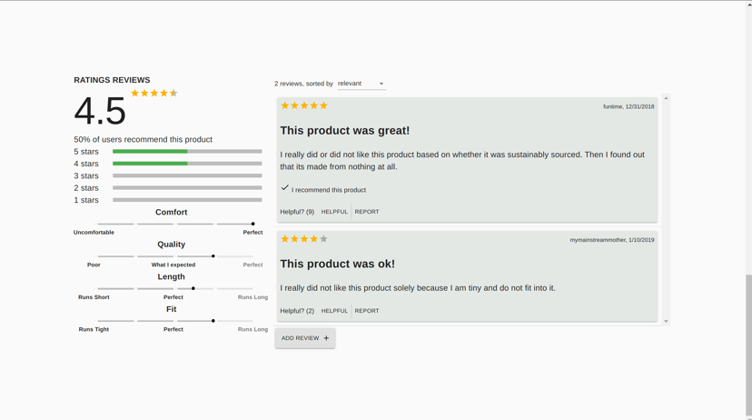

# Thread Lightly


## Overview

E-commerce website redesigned and optimized for a mock client with the ultimate goal of improving an outdated end-user experience and attracting a wider customer base.


## Technology and Tools


## Installation 
1. Clone the repo
```
git clone https://github.com/alejleon/project_catwalk.git
```
2. Install dependencies
```
npm install
```


## Usage
To spin up the website locally, first run: 
 ```
 npm start
 ```
 followed by:
 ```
 npm run react-dev
 ```
 Go to your nearest local 3000 port to test drive the website.
 
 
 ## Preview



General page overview.

---


##### Image Gallery
- Dynamically rendered style information along with style images.
- Clickable images to enter fullscreen mode, with zoom functionality.

---



##### Add-to-cart 
- Does not allow quantity selection without size. 
- Does not allow addition to cart unless both size and quantity are selected. 
- Social media share functionality included.

---



##### Questions & Answers
- Searchable by any keyword. 
- Option to add answers to a question,
- Option to ask your own question.
- Abiltiy to mark questions and answers as helpful.

---



##### Reviews
- Ability to sort through reviews.
- Ability to add your own review.
- Option to mark reviews as helpful.


## Team Members
* Alex Hernandez

* Addie Johnsen 

* Eric Handley 


